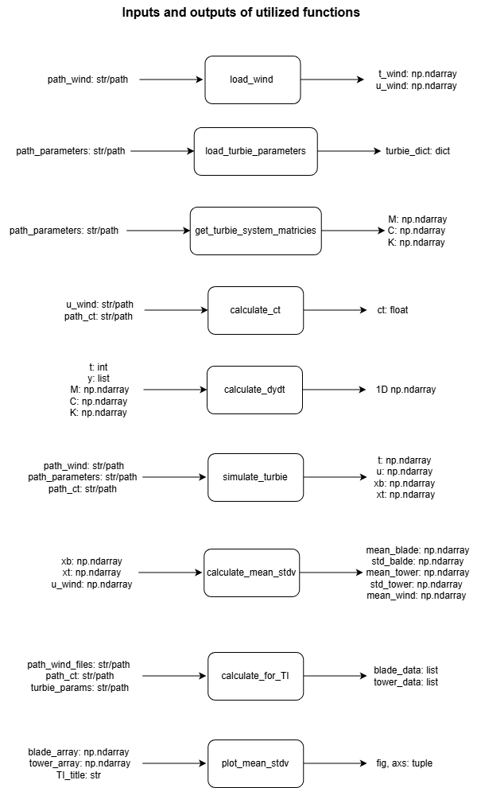
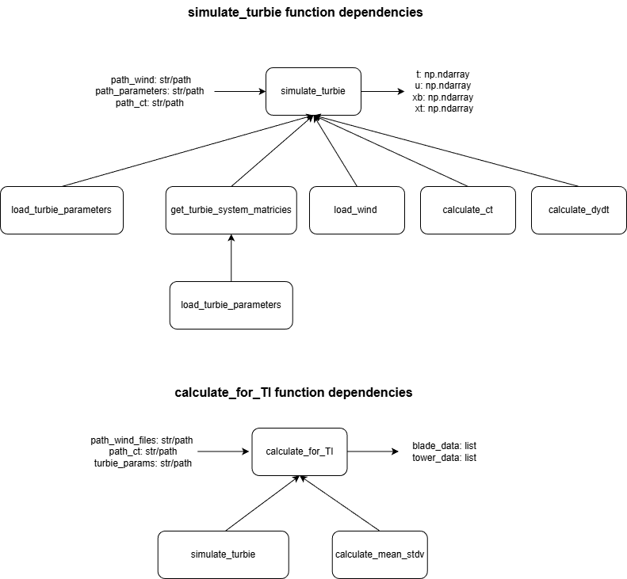
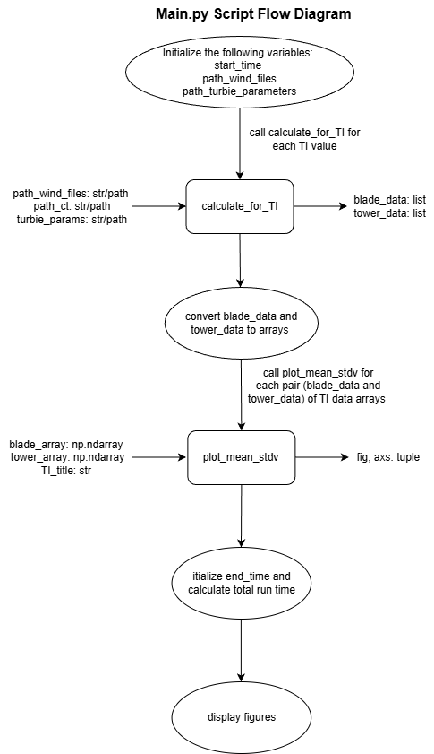

# Our CodeCamp project
# Bughunters 

The code simulates wind turbine blade and tower deflections based on wind speed variations (from 4 m/s to 25m/s). It calculates the mean and standard deviation of the deflections for different wind speeds and different turbulence intensities (TI= 0.1, 0.05, 0.15). The results are plotted to analyze the turbine's response.
The project is developed in 2 parts: the main script (main.py) and the function module (codecamp/__init__). The Main Script calls functions to load data, run simulations, compute calculations and generate plots, while the Function Module contains all the functions needed for data processing, turbine simulation and visualization. Three new functions were added to the function module for the last part of the assignment:
    - calculate_mean_stdv
    - calculate_for_TI
    - plot_mean_stdv
and these are then used in the main.py

## Quick-start guide
- Clone the repository
- Make sure to have all the python packages installed (numpy, matplotlib, pathlib, scipy, pandas, pytest) 
- Ensure that all the files are there (turbie_parameters.txt, CT.txt, wind_TI_o.1/, wind_TI_0.05/, wind_TI_0.15/)
- Run main.py and the script will process all wind speed files, compute deflections mean and stdv, generate plots and print execution time

## How the code works
 This project is structured in: 
 1) Function module (codecamp/__init__)
 2) Main script (main.py)

FUNCTION MODULE

   1. calculate_mean_stdv(xb, xt, u_wind)
   This function calculates the mean and standard deviation of the blade deflection, tower deflection, and wind speed across the entire dataset. The function takes xb, xt and u_wind NumPy arrays from simulate_turbie() function as an input, and returns mean_blade, stdv_blade, mean_tower, stdv_tower and mean_wind as individual values.

   2. calculate_for_TI(path_wind_files,path_ct, turbie_params):
   This function first create 2 empy lists where to store the data later. After it retrieves all the .txt files in the wind dataset and sorts it based on wind speed, so that it is in the correct order. It loops then through each wind speed file. For each wind speed file it calls simulate_turbie(), which reads the wind data, loads turbine system parameters and compute M, C, K matrices. It then returns t, wind, xb, xt. It then calls calculate_mean_stdv() to compute mean and stdv of blade and tower deflections, and mean wind speed. It then appends the results into blade_data and tower_data.

   3. plot_mean_stdv(blade_array, tower_array, TI_title)
   This function creates 2 subplots:
     - Blade Deflection vs. Wind Speed
     - Tower Deflection vs. Wind Speed
   It uses error bars to show standard deviation. The function uses blade and tower array, which come from calculate_for_TI (the lists are first converted into NumPy arrays before calling the function)

      **Function Dependencies**: 

      Multiple functions were used to complete this project. A comprehensive list of the functions used for this project can be seen in the image below. This image shows the functions utilized as well as the inputs and outputs of each function. 
      

      Some of these functions call other functions within the function. This is the case for both the simulate_turbie function and the calculate_for_TI function. 
   
      Within the simulate_turbie function, the following functions are called: 
      - load_turbie_parameters
      - get_turbie_system_matricies 
      - load_wind
      - calculate_ct 
      - calculate_dydt
      Additionaly, get_turbie_system_matricies calls to the load_turbie_parameters functions within the function. 

      Within the calculate_for_TI function, the following functions are called: 
      - simulate_turbie
      - calculate_mean_stdv
      
      A visual representation of functions being called within the simulate_turbie function and the calculate_for_TI function is shown below: 

      

MAIN SCRIPT

   1. Record start time (to measure how long the entire process takes)
   2. Load Turbine Parameters, CT curve and wind datasets for TI= 0.1, 0.05, 0.15
   3. Process each wind speed dataset. For each TI the script calls calculate_for_TI, which reads wind speed files and computes mean and stdv. The function is defined in codecamp/__init__.
   4. Once calculate_for_TI() returns the data, the code converts these lists to NumPy arrays for plotting.
   5. Generate plots, by calling the plot_mean_stdv() function 
   6. Record End Time (to make sure it not exceeds the assignment limit).

   A visual representation of the methodology described above can be seen below. 

   

## Team contributions

Each team member was assigned specific tasks, but we worked collaboratively throughout the process by reviewing each other's work, providing feedback, and managing pull requests.

Kali: complete step 1 and 2 from the pseudocode in the main.py (create the code)
Tessa: complete the README file and creating the drawIO file 
Benni: complete step 3 from the pseudocode in the main.py (create the plots)
